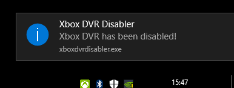
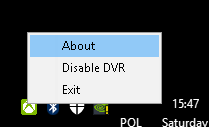

# Xbox DVR Disabler for Windows 10

Please follow [official Steam guide](https://support.steampowered.com/kb_article.php?ref=6239-DZCB-8600) in order to disable DVR in Windows 10. 

If for whatever reason it doesn't work for you, or DVR is being re-enabled on Windows startup (that was my case!) you can use this super simple app which allow you to disable DVR on windows 10 startup.

Application comes with handy installer, [DOWNLOAD HERE](https://github.com/exqstudio/XboxDvrDisabler/raw/master/dist/xboxdvrdisabler_setup.exe)

If you want to compile it by yourself remember to add task to Task Scheduler (run with highest priveledges)

